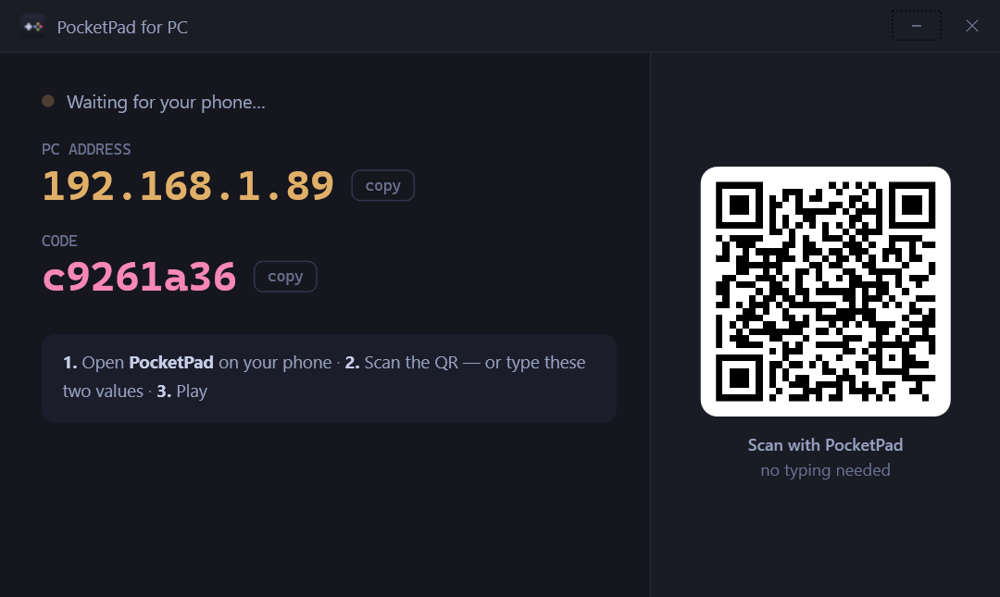
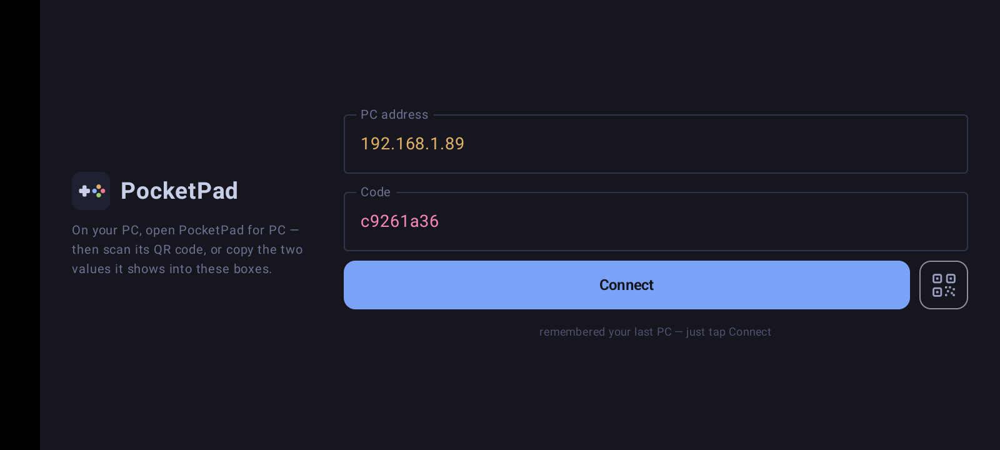
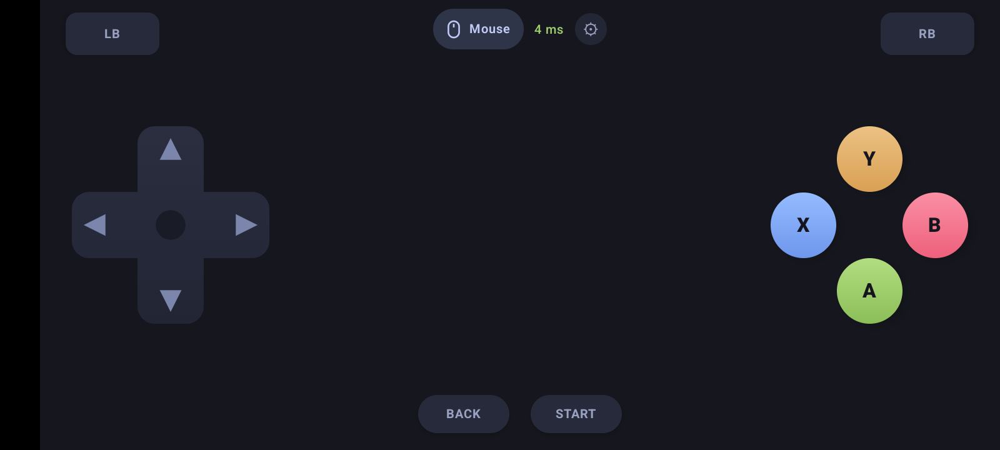

# PocketPad — Step-by-step guide

This guide is for everyone, even if you have never used GitHub before.
You need **two things**: a **Windows PC** and an **Android phone**, on the **same Wi-Fi**.

It takes about 5 minutes the first time. After that, playing is just: open the app on the PC → tap **Connect** on the phone.

---

## Part 1 — Install on your PC

1. On your PC, click this link to download the installer:
   **[⬇ Download PocketPad for PC](https://github.com/luzazzm-stack/PocketPad/releases/latest/download/PocketPad-Setup.exe)**
   *(file name: `PocketPad-Setup.exe`, about 52 MB)*
2. When it finishes downloading, open it. You'll usually find it in your **Downloads** folder.
3. Windows may show a blue box saying **"Windows protected your PC"**.
   This appears because the app is new and not yet signed with a paid certificate.
   Click **More info** → **Run anyway**.
4. Click **Yes** when Windows asks for permission, then **Next → Next → Install → Finish**.
5. A **PocketPad** icon is now on your desktop. Double-click it and click **Yes** when Windows asks for permission.

You'll see this window. Keep it open while you play:

> **Why does it ask for permission every time?** PocketPad creates a game controller and can move your mouse.
> Windows only allows that with administrator permission. Click **Yes** each time.

---

## Part 2 — Install on your Android phone

1. On your **phone**, open this page in the browser (Chrome) and tap this link:
   **[⬇ Download PocketPad for Android](https://github.com/luzazzm-stack/PocketPad/releases/latest/download/PocketPad.apk)**
   *(file name: `PocketPad.apk`, about 2 MB)*

   *Easier way:* open this page on your phone by typing `github.com/luzazzm-stack/PocketPad` into the phone's browser.
2. When the download finishes, tap **Open** (or open it from your **Downloads**).
3. Your phone may say **"For your security, your phone is not allowed to install unknown apps from this source."**
   Tap **Settings** → turn on **Allow from this source** → go back.
4. Tap **Install**, then **Open**.

> PocketPad isn't on the Google Play Store yet, so Android shows this one-time warning for any app installed from a website.

---

## Part 3 — Connect the phone to the PC

1. Make sure the **phone and PC are on the same Wi-Fi**.
2. On the PC, open **PocketPad for PC**. It shows a **QR code**.
3. On the phone, open **PocketPad** and tap the **QR button** (the small square next to **Connect**).
4. Point the phone camera at the QR code on the PC screen. It connects by itself.

**No camera, or the QR won't scan?** Type the **amber number** from the PC into **PC address** and the **pink code** into **Code**, then tap **Connect**.

When it works, the PC window turns **green** and shows your phone's name.

**Next time** you only open both apps and tap **Connect**. Your phone remembers the PC.
If the PC moves to a different Wi-Fi, the phone finds it again by itself ("Looking for your PC…").

---

## Part 4 — Play

1. Connect first, **then** start your game.
2. The game sees a normal **Xbox controller**, so there's nothing to set up in the game.

- The **green number** at the top is the delay. Under 20 ms feels instant.
- **Mouse** (top of the screen) turns the phone into a touchpad for clicking around Windows.
- **⚙ gear** opens settings: vibration strength, mouse speed, and **Customize layout** to move or hide any button.
- **Up to 4 phones** can join the same PC. Each one becomes its own controller, so friends just scan the same QR.

---

## Something not working?

| What you see | What to do |
|---|---|
| **"Couldn't find the PC"** | Check the PC app is open, and that both are on the **same Wi-Fi**. Then scan the QR again. |
| **It never connects on hotel, café, airport or office guest Wi-Fi** | Those networks block devices from talking to each other. Turn on your **phone's hotspot** and connect the PC to it. |
| **"That code has expired"** | Scan the QR on the PC again. The code stays the same from then on. |
| **The game doesn't react** | Connect first, then start the game. If the game was already open, restart it. |
| **The delay number is orange or red** | Move closer to the Wi-Fi router. |
| **It disconnects by itself** | On the phone: Settings → Apps → PocketPad → Battery → **Unrestricted** (or turn off battery optimisation). |
| **Can't find the PC window** | It hides next to the Windows clock (bottom-right). Double-click the PocketPad icon there. |
| **"Windows protected your PC"** | Click **More info** → **Run anyway**. See Part 1. |

---

## Updating

Download the same two links again and install over the old version. Your settings and button layout are kept.

## Removing it

- **PC:** Windows **Settings → Apps → Installed apps → PocketPad → Uninstall**.
- **Phone:** press and hold the PocketPad icon → **Uninstall**.
