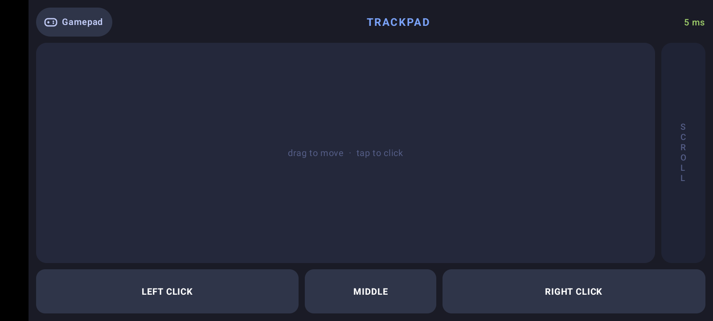
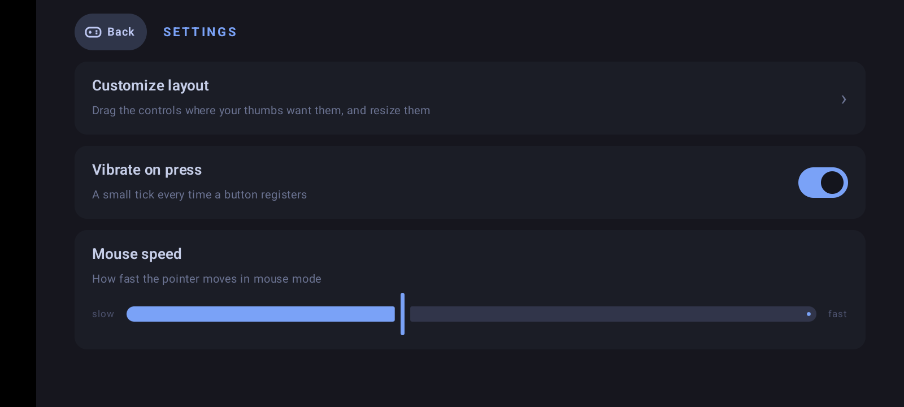
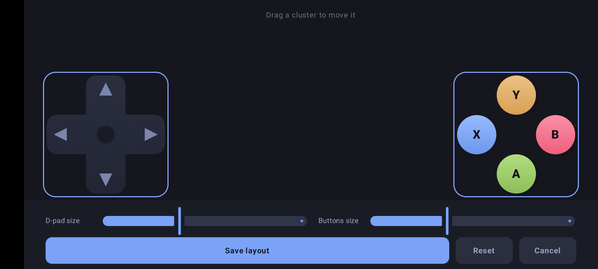

<div align="center">

# 🎮 PocketPad

**Turn your Android phone into a wireless game controller for Windows — with 3–5 ms latency.**

Your phone becomes the gamepad. Your PC sees a real Xbox controller. Every game just works.
**Up to 4 phones connect at once** — each gets its own controller, so two phones = instant local versus.

</div>

---

## How to use it

### 1 · On the PC — open **PocketPad for PC**

Double-click the PocketPad icon on your desktop. This window opens:


- The **amber number** is your PC address
- The **pink code** is new every time you open the app
- The **QR code** is the shortcut that skips typing

Keep this window open while you play. Closing it just tucks it away next to the
Windows clock — the controller keeps working. Right-click that tray icon → Quit
to stop completely.

### 2 · On the phone — open **PocketPad** and scan (or type)

**Easy way:** tap the QR button next to Connect, point the camera at the PC
screen — it connects by itself.

**Typing way:** copy the amber address into the top box, the pink code into the
bottom box, tap **Connect**:


PocketPad remembers your PC — from the second time it's just open → Connect.
Both devices must be on the **same Wi-Fi** (or the PC's own hotspot).

### 3 · Start your game

The PC window turns green and names your phone. Start the game **after**
connecting — it sees a normal Xbox 360 controller, nothing to configure.

---

## The controller


Slide your left thumb on the cross — diagonals happen automatically where the
arms meet. The green number at the top is your live delay; under 20 ms feels
instant.

| Control | In menus | In Tekken 7 |
|---|---|---|
| ✚ cross | Move around | Walk & jump · hold away to block |
| 🔵 X | — | Left punch |
| 🟡 Y | — | Right punch |
| 🟢 A | Choose / OK | Left kick |
| 🔴 B | Go back | Right kick |
| LB | — | Throw |
| RB | — | Rage Art |
| START | OK / skip videos | Pause |
| BACK | Go back | Change side |

## Play with friends

Up to **4 phones** join the same PC — each becomes its own Xbox controller
(P1–P4, shown in the PC window with per-phone delay). Everyone scans the same
QR; the connected view keeps showing it so the next player can join. Then just
pick local versus in the game.

## Mouse mode

A controller can't double-click a desktop icon. Tap **Mouse** at the top of the
gamepad and the phone becomes a laptop-style trackpad — drag to move, tap to
click, scroll strip on the right edge, real click buttons along the bottom.



## Make it yours

Tap the **⚙ gear** on the gamepad:



**Vibrate on press** has Light / Medium / Strong levels — tap one to feel it.

**Customize layout** lets you drag the cross and the buttons anywhere your
thumbs prefer, and resize them — saved permanently:



The **?** button (settings, connect screen, and the PC title bar) opens this
guide inside the app.

## If it doesn't work

| Problem | Fix |
|---|---|
| Connect fails | Same Wi-Fi on both? PC window open? Scan the QR — it can't mistype |
| "Code has expired" | The code renews when the PC app opens. Use the one on screen now |
| Game doesn't react | Connect first, *then* start the game. Already running? Restart it |
| Delay is orange | Move closer to the router, or use the PC's hotspot |
| Disconnects on its own | Turn Android battery optimisation **off** for PocketPad |
| Can't find the PC window | It's by the Windows clock — double-click its tray icon |

---

## Under the hood

Two apps, one 16-byte protocol:

- **`android/`** — Kotlin + Jetpack Compose. Touch → state packets over UDP at
  125 Hz (TCP for pairing + latency echo). QR pairing via `pocketpad://` URIs.
- **`windows/`** — .NET 8. `PocketPad.Core` hosts the whole session
  (`LinkSession`); the WPF app (`PocketPad.App`) renders it; a virtual Xbox 360
  pad is created through the [ViGEm](https://github.com/nefarius/ViGEmBus)
  driver, and mouse mode injects real input via `SendInput`.
- **`protocol/PROTOCOL.md`** — the wire format, pinned by identical golden-byte
  tests on both sides.

### Build it

```
# Windows side           # Android side
cd windows               cd android
dotnet build             ./gradlew assembleDebug
dotnet test              ./gradlew test
```

Requires .NET 8 SDK + ViGEmBus driver (Windows) and JDK 17 + Android SDK 35
(Android). The full illustrated manual lives at
[`docs/manual.html`](docs/manual.html) and ships inside both apps.
